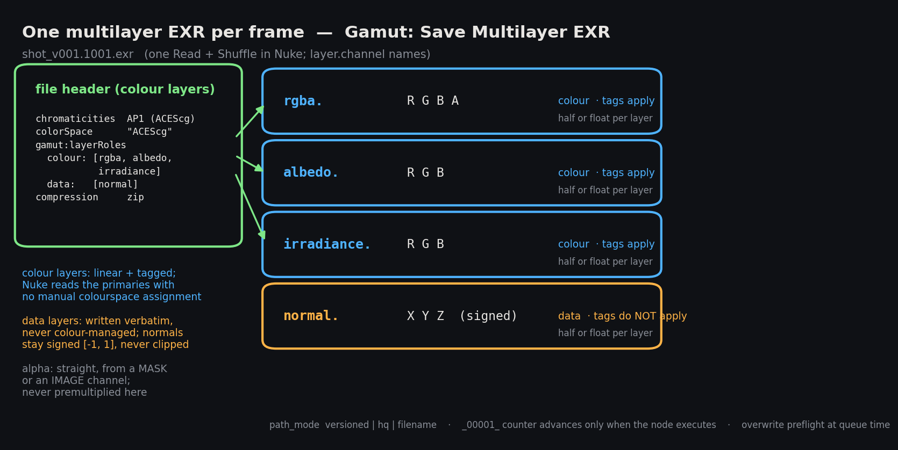
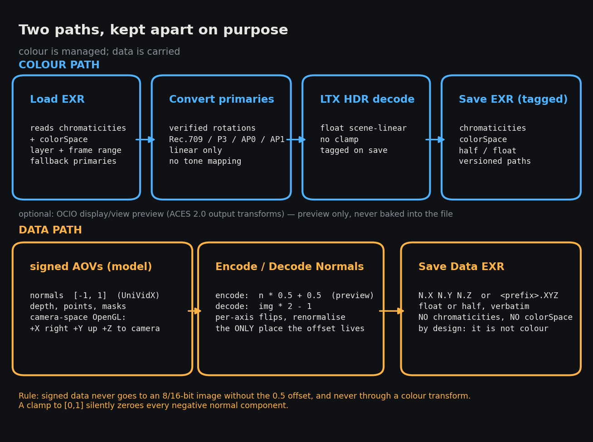

# ComfyUI-Gamut

Carry colour declarations and signed AOVs from ComfyUI into EXR-based VFX pipelines.

For compositors and lighting artists handing plates, generated images and AOVs to Nuke.
Gamut keeps that handoff EXR-native: colour passes carry explicit primaries and transfer tags, while normals, depth and masks stay on a data path outside colour management.

[](LICENSE)
[](https://github.com/pttsonev/ComfyUI-Gamut)
[](pyproject.toml)
[](pyproject.toml)



## 🎨 What you get

- Read and write tagged colour EXRs with `chromaticities` and `colorSpace` attributes describing the primaries and transfer.
- Rotate verified linear-light primaries between Rec.709, ACEScg, AP0 and Rec.2020; encode or decode transfer curves.
- Decode LTX LogC3 HDR IC-LoRA output and preview through optional OpenColorIO display/view nodes.
- Load and save non-colour AOVs; encode/decode signed normals with per-axis flips and optional renormalisation.
- Pack rgb/rgba, albedo, irradiance and `normal.X/Y/Z` into **one EXR per frame**, with per-layer half/float precision and a `gamut:layerRoles` map.
- Load layers and frame sequences; save EXRs with shared version, HQ-counter or filename controls and overwrite protection.

## Quick start

Clone [this pack](https://github.com/pttsonev/ComfyUI-Gamut) into `ComfyUI/custom_nodes/ComfyUI-Gamut`, or junction that folder to your checkout. Install with **ComfyUI's Python**, then restart ComfyUI:

```sh
cd ComfyUI/custom_nodes/ComfyUI-Gamut
python -m pip install .
```

Gamut needs **no model files**. For optional OCIO nodes, install `python -m pip install ".[ocio]"` in the same environment. For AOV generation, pair it with [ComfyUI-UniVidX](https://github.com/pttsonev/ComfyUI-UniVidX), whose weights live under `ComfyUI/models/`.

A colour graph from a tagged EXR to the show's linear working primaries:

```text
Tagged plate → Gamut: Load EXR (tonemap_preview=False)
IMAGE + COLORSPACE → Gamut: Transfer (decode, if the incoming transfer is non-linear)
Linear IMAGE + COLORSPACE → Gamut: Color Space Convert (to_primaries=acescg)
Converted IMAGE + COLORSPACE → Gamut: Save EXR → Nuke
```

Wire `COLORSPACE` alongside `IMAGE`; it supplies the source declaration instead of guessing from pixels. Load EXR prioritises recognised header metadata, then a wired declaration, then fallback widgets. Save widgets **declare existing pixels**; use transform nodes to change those pixels first.

## Nodes

Categories: `Gamut/Colour`, `Gamut/Data`, `Gamut/IO`, `Gamut/LTX`, `Gamut/Info`, and optional `Gamut/OCIO`.

| Node | What it does | Key widgets |
|---|---|---|
| Gamut: Color Space Convert | Rotate linear RGB primaries | `from_primaries=rec709`, `to_primaries=acescg` |
| Gamut: Transfer | Decode to linear light or encode a curve | `direction=decode`, `curve=srgb`, `primaries=rec709` |
| Gamut: Normal Decode | Convert IMAGE codes to signed vectors | `renormalise`, `flip_x`, `flip_y`, `flip_z` (all off) |
| Gamut: Normal Encode | Convert signed vectors to display codes | Same controls, all off |
| Gamut: Load EXR | Read a colour layer or sequence plus mask and tags | `path`, `layer`, `frame_count`, `tonemap_preview=False` |
| Gamut: Load Data EXR | Read raw vector layers or sequences | `layer=normal`, `components=XYZ`, `frame_count` |
| Gamut: Save EXR | Write tagged RGB/RGBA with optional alpha | `primaries`, `transfer`, `half=True`, `compression=zip`, `alpha_channel=R` |
| Gamut: Save Multilayer EXR | Write colour passes and signed normal in one file | `rgb_half`, `albedo_half`, `irradiance_half` (on); `normal_half` (off) |
| Gamut: Save Data EXR | Write three data channels without colour tags | `channel_naming=normals`, `channel_prefix=N`, `half=True` |
| Gamut: Save High Bit | Write clipped 16-bit PNG/TIFF | `format=png16`, `transfer=srgb`, `dither=False` |
| Gamut: LTX HDR Decode | Decode encoded HDR IC-LoRA VAE output | `target_primaries=rec709`, `exposure=0.0` |
| Gamut: Color Space Info | Inspect declarations, tensors, EXR layers and tags | `path`; optional IMAGE / COLORSPACE inputs |
| Gamut: OCIO Transform | Convert using an OCIO config | `config`, `src`, `dst` |
| Gamut: OCIO Display View | Preview from an explicit source space | `config`, `src`, `display`, `view` |
| Gamut: Apply LUT | Apply an OCIO file transform | `lut_path`, `direction=forward`, `interpolation=linear` |

The OCIO nodes register only when `opencolorio` is installed; the core nodes work without it.

## Recommended settings

| Handoff | Settings / connections |
|---|---|
| HDR colour EXR | Keep `tonemap_preview=False`; decode transfer before rotating primaries; pass IMAGE + COLORSPACE to Save EXR. Default storage is half with ZIP compression. |
| LTX HDR → ACEScg | Encoded LogC3 VAE output → LTX HDR Decode, `target_primaries=acescg`, `exposure=0.0` → Save EXR. Already-linear output goes directly to Color Space Convert. |
| Linear/HDR plate → UniVidX | Load EXR, `tonemap_preview=True` → UniVidX `input_encoding=display_referred_srgb`. This rotates to Rec.709, clips to `[0,1]` and sRGB-encodes. |
| UniVidX → multilayer EXR | Connect rgb / albedo / irradiance; Normal Decode → `normal`. Declare the actual colour encoding shared by all colour layers. Default colour layers are half; normals are float32. |
| Standalone normal EXR | Normal Decode → Save Data EXR, `channel_naming=normals`; choose `half=False` for float32 vectors (the node default is half). |
| Attach an alpha IMAGE | Connect `alpha_image`, choose `alpha_channel=R` for UniVidX `pha`; embedding alpha does not premultiply RGB. |



**Signed normals:** encode with `x * 0.5 + 0.5`; decode with `(x - 0.5) * 2`. UniVidX's decoder emits IMAGE codes, so decode them before saving vector data. Never clip signed normals to `[0,1]` or send normals, depth or masks through colour transforms. Axis flips and renormalisation are explicit, off by default.

<details>
<summary>Multilayer EXR, alpha and the Nuke handoff</summary>

Root `R/G/B` plus optional `A` is Nuke's rgba; auxiliary layers are `albedo.R/G/B`, `irradiance.R/G/B` and `normal.X/Y/Z`. Inputs must share frame count and dimensions. Only connected passes are written, and half overflow is refused before writing.

File-level `chromaticities` and `colorSpace` describe **all colour layers**, which must share primaries and transfer. Optional per-pass COLORSPACE sockets validate agreement; the saver performs no per-layer conversion. Tags make the colour declaration explicit for the handoff, but do not make vector layers colour images.

`gamut:layerRoles` records `colour` and `data` layer lists (`rgba` means root beauty). This is a Gamut annotation, not a Nuke/OCIO standard. For a mixed file, use a Nuke Read with **Raw Data** enabled, Shuffle the passes, then convert only colour branches from the declared space to the show's working space. Keep normal XYZ unchanged and verify the handoff in the target Nuke/OCIO setup.

Save EXR and Save Multilayer EXR accept either `alpha_mask` (transparency; stored A is `1-mask`) or `alpha_image` (opacity from R/G/B/A). An external source must be finite, within `[0,1]`, and match the batch and dimensions; it replaces existing A. Without it, RGBA alpha is preserved and RGB writes no A. Premultiply deliberately downstream when required.

Standalone Save Data EXR writes `N.X/Y/Z` or `<channel_prefix>.X/Y/Z` with **no colour metadata**. It requires exactly three IMAGE channels; scalar depth or mask values must be replicated into three channels. Load Data EXR reads `normal` / XYZ by default; use `layer=N` for standalone normal exports.

</details>

<details>
<summary>Sequence loading and shared EXR save paths</summary>

Both loaders accept an exact filename or one frame token: `{frame}`, `####` or `%04d`. Defaults are `start_frame=1001`, `frame_count=1`, `frame_step=1`, `frame_pad=4`; `layer=""` selects root colour. Frames must agree in selected channels, windows and colour declarations. Missing frames, multipart/deep files and subsampled selected channels are refused; offset data windows load cropped pixels without preserving their origin in IMAGE.

All EXR savers share `prefix`, `path_mode`, `version_layout` and `create_path_if_missing`. Defaults: `path_mode=versioned`, `version_layout=suffix`, `version=1`, `start_frame=1001`, `frame_pad=4`, `create_path_if_missing=True`.

| Mode / layout | Prefix | Output example |
|---|---|---|
| `versioned` / `suffix` | `shots/beauty` | `shots/beauty_v001.1001.exr` |
| `versioned` / `directory` | `shots/beauty` | `shots/v001/beauty.1001.exr` |
| `versioned` / `none` | `shots/beauty` | `shots/beauty.1001.exr` |
| `hq`, relative | `shots/beauty` | `shots/beauty_00001_.exr`, then `_00002_` |
| `hq`, absolute | `D:/show/beauty` | `D:/show/beauty_v001.1001.exr` |
| `filename`, single image | `D:/show/custom.exr` | Exactly `D:/show/custom.exr` |
| `filename`, batch | `shots/{version}/custom.{frame}.exr` | `shots/v001/custom.1001.exr` onwards |

Relative paths resolve under ComfyUI/output. Absolute paths are used verbatim, without environment-variable, `~` or ComfyUI template expansion; selected version/frame naming still applies. Filename mode alone expands `{version}` and `{frame}`, requires `{frame}` for batches, and adds no suffix or counter.

Relative HQ paths ignore version/frame/layout controls. Their `_00001_` counter advances **only when the saver executes**; an unchanged cached requeue writes nothing. Save High Bit retains its fixed version/frame naming and existing controls.

Queue-time preflight checks resolvable first-frame collisions and parent-directory failures without creating directories. Set `create_path_if_missing=False` to require the destination directory. Dynamic destinations defer unresolved checks to execution; the entire batch is checked before saving, and exclusive creation prevents overwrites. A later IO failure can leave earlier complete frames.

</details>

## Hardware

| Resource | Requirement / behaviour |
|---|---|
| Runtime | Python 3.10+, torch, NumPy ≥1.24, OpenEXR ≥3.3; OpenEXR 3.4.4 verified for IO |
| CPU / GPU | Core colour math supports CPU and CUDA; EXR IO and OCIO run on CPU |
| Host RAM | Selected colour frames use approximately `frames × height × width × 16` bytes; data uses `× 12`, plus one decoded source frame with all layers |
| Optional preview | OpenColorIO ≥2.5; no model weights required |

Limit `frame_count` when loading large shots; sequences remain in host memory.

## Boundaries & licence

Gamut transforms declared colour and preserves data values; it cannot infer colour encoding from image appearance. Primaries rotations require linear light. `tonemap_preview` and 16-bit PNG/TIFF output clip to `[0,1]`; use EXR to preserve negative values and HDR highlights.

The pack is [MIT-licensed](LICENSE), with upstream attribution in [NOTICE](NOTICE). It pairs with UniVidX without importing its code or models.

## Development

From this pack's directory:

```sh
python -m pytest tests -q
```

OCIO and CUDA cases skip when unavailable. Changes receive independent review in a fresh thread, with corrections reviewed until `APPROVED` before the integration PR. No separate lint/type-check tool is configured.

---

Credits: [spacepxl/ComfyUI-HQ-Image-Save](https://github.com/spacepxl/ComfyUI-HQ-Image-Save) for IO discipline and the piecewise sRGB formulation; OpenEXR and OpenColorIO for the file and colour tooling.
